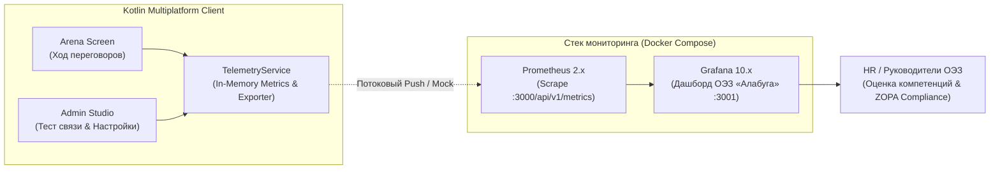
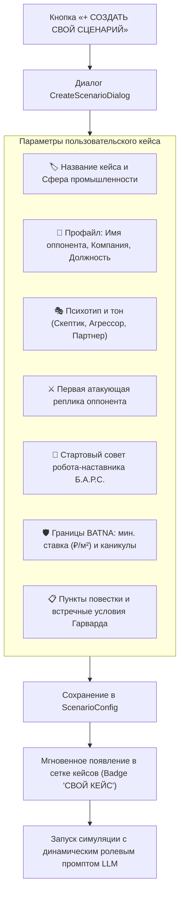
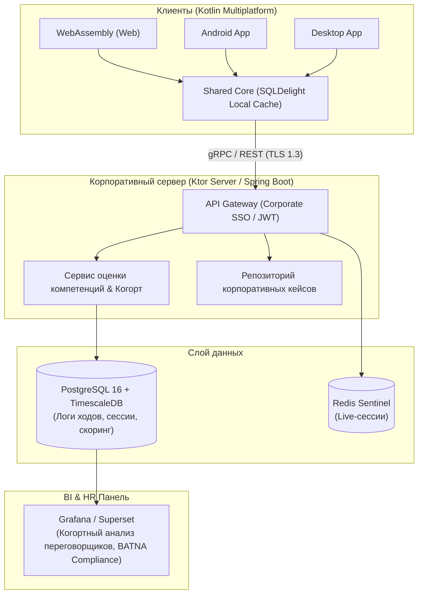

<div align="center">

# 🦾 АРЕНА B2B-ПЕРЕГОВОРОВ • ОЭЗ «АЛАБУГА»
### *Интерактивный AI-тренажер стратегических сделок с 3D-наставником Б.А.Р.С., гарвардской методологией ZOPA и корпоративной телеметрией Grafana*

[](https://github.com/linskay/lct2026-alabuga)
[](https://kotlinlang.org/)
[](https://www.jetbrains.com/lp/compose-multiplatform/)
[](https://kotl.in/wasm)
[-3DDC84?style=for-the-badge&logo=android&logoColor=white)](https://developer.android.com/)
[](https://www.jetbrains.com/lp/compose-multiplatform/)
[](http://localhost:3001)
[](https://github.com/linskay/lct2026-alabuga)

<br/>

> **«Учись побеждать в B2B-сделках без необоснованных уступок. Защищай BATNA, держи красные линии ОЭЗ «Алабуга», контролируй ZOPA и анализируй метрики в корпоративной Grafana!»**

---

## 📋 ЧТО УЖЕ ПОЛНОСТЬЮ РЕАЛИЗОВАНО

| Модуль / Фича | Статус | Платформы | Описание реализации |
| :--- | :---: | :---: | :--- |
| **🤖 Единый 3D-робот Майк / Б.А.Р.С.** | ✅ Готово | Web, Android, Desktop | Полигональная 3D-модель `mike.glb` (с fallback на `bars.glb`) с аппаратным рендерингом (Google `<model-viewer>` на WebAssembly/Android SceneView, JMonkeyEngine 3.9 на Desktop). Анимации: `wave`, `nod`, `tilt`, `talk`, `idle` со стейт-контроллером. |
| **🧠 Продвинутый AI-оппонент & Б.А.Р.С.** | ✅ Готово | Все платформы | Dual API: **Google Gemini 2.5 Flash** + **OpenRouter**. Persona Grounding, Tone Matching (осаживание фамильярности), 100% динамические B2B подсказки без заглушек `[ ]`. |
| **🏆 Мультиплатформенные ачивки** | ✅ Готово | Все платформы | Интегрированы арт-изображения наград (`batna_shield.jpg`, `bluff_buster.jpg`, `hidden_pain.jpg`, `power_capex.jpg`, `grandmaster_s.jpg`) с динамической проверкой выполнения условий под каждый сценарий. |
| **📱 Адаптивная верстка (Android & Desktop)** | ✅ Готово | Android, Desktop, Web | Двухрежимная адаптивная верстка (`BoxWithConstraints`): на смартфонах — Cyber-Glass таб-переключатель «ДИАЛОГ» / «ТАКТИКА И ZOPA» с `imePadding()`, компактным 3D-аватаром и полноразмерным чатом; на десктопе — классический сплит 65/35. |
| **📄 Выгрузка PDF-отчета с советами** | ✅ Готово | Все платформы | Полноценный генератор аналитического отчета А4: Android `PdfDocument` + `FileProvider`, Desktop Swing Print / IText, Wasm-JS Print API. Включает индивидуальные зоны роста и советы по развитию компетенций. |
| **⚡ Новый боевой сценарий «ИИ-кластер»** | ✅ Готово | Все платформы | 5-й боевой пресет «Аренда мощностей под ЦОД и ИИ (Елена Воронова)»: 15 МВт, BATNA 4.80 ₽/кВт·ч, энергоэффективность PUE <= 1.25 и целевое обучение 40 инженеров в «Политехе». |
| **🛡️ ИИ-Цензор («Анти-Базар»)** | ✅ Готово | Все платформы | Жесткий семантический фильтр: блокирует отправку «голых» цифр (*«500»*, *«+50»*) и фраз без встречных условий. Заставляет игрока обосновывать позицию. |
| **⚖️ Гарвардский ZOPA & BATNA Engine** | ✅ Готово | Все платформы | Динамический расчет коридора согласия, учет красных линий ОЭЗ, защита ставки аренды (460 ₽/м²), увязка цен с мощностями 110 кВ и инвестициями CAPEX. |
| **🛠️ Студия сценариев (Admin Studio)** | ✅ Готово | Все платформы | Конструктор кейсов с кастомной повесткой, BATNA, выбором психотипа оппонента, управлением API-ключами и настройками телеметрии. |
| **⏳ Time Travel & Тактический откат** | ✅ Готово | Все платформы | Возможность перемотать раунд назад, изменить тактику и разобрать ошибки с наставником Б.А.Р.С. |
| **📈 Корпоративная телеметрия Grafana** | ✅ Готово | Все платформы | Встроенный сервис сбора метрик Prometheus (0.0.4), преднастроенный дашборд Grafana, заглушки эндпоинтов и кнопка тестирования соединения в админке. |
| **🐳 Docker & One-Click Deploy** | ✅ Готово | Сервер / Web | Multi-stage Dockerfile, docker-compose со связкой: Wasm Web App + Prometheus + Grafana + Ollama Local LLM. |

---

## 📌 О проекте

**Арена B2B-переговоров ОЭЗ «Алабуга»** — это интерактивный симулятор стратегических переговоров нового поколения. Платформа обучает руководителей и резидентов жесткому и принципиальному торгу по Гарвардскому методу, где любая уступка в цене обязана компенсироваться встречными выгодами (инвестициями в CAPEX, сроками ввода оборудования, налоговыми условиями или объемами энергопотребления).

---

## 📊 Мониторинг, Аналитика и Grafana Telemetry

Платформа оснащена встроенной подсистемой телеметрии (`TelemetryService`), которая собирает показатели каждого хода и агрегирует их в формате **OpenMetrics / Prometheus 0.0.4**.



### 📈 Ключевые метрики, собираемые в Grafana:
1. `alabuga_deals_closed_total` — общее число успешно закрытых контрактов в рамках ZOPA.
2. `alabuga_deals_failed_total` — число проваленных/сорванных переговоров.
3. `alabuga_negotiation_rounds_total` — общее количество сыгранных раундов.
4. `alabuga_anti_bazaar_blocks_total` — число срабатываний фильтра «Анти-Базар» (попытки отправить «голые» цифры).
5. `alabuga_avg_trust_score` — средний индекс доверия оппонента (0..100%).
6. `alabuga_avg_stress_score` — средний уровень психологического напряжения (0..100%).
7. `alabuga_last_agreed_price` — последняя зафиксированная ставка аренды (₽/м²).
8. `alabuga_llm_latency_ms` & `alabuga_llm_requests_total` — задержка и частота вызовов языковой модели.

### 🕹️ Управление в интерфейсе Администратора:
- **Переключатель «Потоковая телеметрия»**: мгновенное включение/отключение отправки данных.
- **Поле URL Grafana / Prometheus**: указание локального (`http://localhost:3001`) или корпоративного инстанса.
- **Кнопка «ТЕСТ СВЯЗИ»**: проверка доступности инстанса Grafana через `/api/health` со встроенной заглушкой (Mock/Stub 200 OK).
- **Кнопка «Показать Prometheus Metrics»**: живой просмотр текущего текстового буфера метрик в стандарте Prometheus.

---

## 🛠️ Студия Администратора & Конструктор Сценариев (Scenario Studio)

В платформу встроен полноценный визуальный конструктор сценариев (`CreateScenarioDialog` в составе `AdminScreen.kt`), позволяющий методистам ОЭЗ «Алабуга» и руководителям создавать собственные боевые кейсы переговоров прямо из интерфейса без перекомпиляции приложения:



### 🧩 Возможности конструктора:
1. **Кастомизация профиля оппонента**: задание имени, должности, компании и психотипа (например: *«Манипулятор, давящий на дедлайны»* или *«Прагматичный инвестор с фокусом на окупаемость»*).
2. **Гибкие границы BATNA & ZOPA**: установка индивидуальной минимальной ставки аренды, лимита арендных каникул и списка защищаемых красных линий ОЭЗ.
3. **Настройка стартового контекста**: задание первой атакующей реплики контрагента и рекомендаций наставника Б.А.Р.С.
4. **Управление LLM-провайдерами**: безопасное сохранение API-ключей Google Gemini и OpenRouter с мгновенным переключением.
5. **Тестирование телеметрии Grafana**: живая валидация связи с корпоративным сервером аналитики.

---

## 🏛️ Архитектура проекта (100% Kotlin Multiplatform)

```
lct2026-alabuga/
├── shared/                                 # Мультиплатформенное ядро бизнес-логики и UI
│   ├── commonMain/kotlin/ru/alabuga/arena/
│   │   ├── model/                          # Модели данных (ScenarioConfig, BatnaRules, Telemetry, AppSettings)
│   │   ├── network/                        # KtorGeminiService (Dual API: Gemini + OpenRouter + Dynamic Fallback)
│   │   ├── telemetry/                      # TelemetryService (Prometheus Exporter, Grafana Client & Mock Stub)
│   │   ├── ui/
│   │   │   ├── components/                 # BarsRobotView, DebriefingModal, TimeTravelModal, ZopaMapCard
│   │   │   └── screens/                    # ArenaScreen, AdminScreen, HomeScreen
│   │   └── util/                           # Экспорт отчетов в PDF
│   ├── androidMain/                        # Android WebView <model-viewer> Host
│   ├── desktopMain/                        # Desktop JMonkeyEngine 3.9 GLB Renderer & AWT PDF Preview
│   └── wasmJsMain/                         # Wasm-GC DOM Bridge & Hardware <model-viewer>
├── app/                                    # Android Application (SDK 26–34, Material 3)
├── desktop/                                # Desktop Application (Windows MSI / Executable UberJar)
├── web/                                    # WebAssembly браузерное SPA (Wasm GC)
├── monitoring/                             # Конфигурация Prometheus и Grafana
│   ├── prometheus/                         # prometheus.yml (Scrape target configuration)
│   └── grafana/
│       ├── provisioning/                   # Автозагрузка датасорсов и дашбордов
│       └── dashboards/                     # alabuga_arena_dashboard.json (Готовый дашборд)
├── .github/workflows/                      # CI/CD автоматической кроссплатформенной сборки
├── Dockerfile                              # Multi-stage Nginx + Wasm сборка
└── docker-compose.yml                      # Полный стек: Web App + Prometheus + Grafana + Ollama
```

---

## 🚀 Сборка и запуск

### Требования:
- **Java**: JDK 21 (Eclipse Adoptium / Temurin / Azul Zulu)
- **Node.js**: 20+ (для WebAssembly)
- **Docker** (для запуска сервера и мониторинга)

---

### 🐳 1. Запуск через Docker (Веб + Prometheus + Grafana)

#### Полный запуск с мониторингом Grafana:
```bash
docker compose --profile all up -d --build
```
- 🌐 **Арена Переговоров**: `http://localhost:3000`
- 📊 **Grafana Дашборд**: `http://localhost:3001` (Логин: `admin`, Пароль: `alabuga`)
- 📈 **Prometheus Metrics**: `http://localhost:9090`

---

### 🌐 2. WebAssembly (Браузерная разработка)
```bash
# Запуск dev-сервера с поддержкой Hot-Reload (порт 8080)
./gradlew :web:wasmJsBrowserDevelopmentRun

# Продакшн-бандл
./gradlew :web:wasmJsBrowserDistribution
```

---

### 📱 3. Android (APK)
```bash
# Сборка отладочного APK
./gradlew :app:assembleDebug
```
> Готовый APK: `app/build/outputs/apk/debug/app-debug.apk`

---

### 🪟 4. Desktop (Windows MSI / Standalone JAR)
```bash
# Универсальный исполняемый UberJar (работает на любом ПК с Java 21)
./gradlew :desktop:packageUberJarForCurrentOS

# Нативный установщик Windows MSI
./gradlew :desktop:packageDistributionForCurrentOS
```
> Готовый JAR: `desktop/build/compose/jars/AlabugaArena-windows-x64-1.0.0.jar`

---

## 🔮 RFC: Интеграция с Корпоративной БД и HR-контуром



### Задачи будущего расширения:
1. **Когортный анализ переговорщиков**: сопоставление результатов тренировок сотрудников различных отделов (продажи, закупки, управление резидентами).
2. **Интеграция с LMS ОЭЗ**: передача результатов дебрифинга через стандарты xAPI / SCORM.
3. **Офлайн-синхронизация SQLDelight**: локальное прохождение сессий в самолете или на выезде с автосинкапом при появлении сети.

---

## 👥 Команда разработчиков

**«NO PHP — NO PROBLEMS — 2026»**
- Разработано специально для **ОЭЗ «Алабуга»**.
- Стек: *100% Kotlin Multiplatform (Compose, Coroutines, Ktor, Wasm-GC, JMonkeyEngine, Material 3, Grafana, Prometheus)*.
