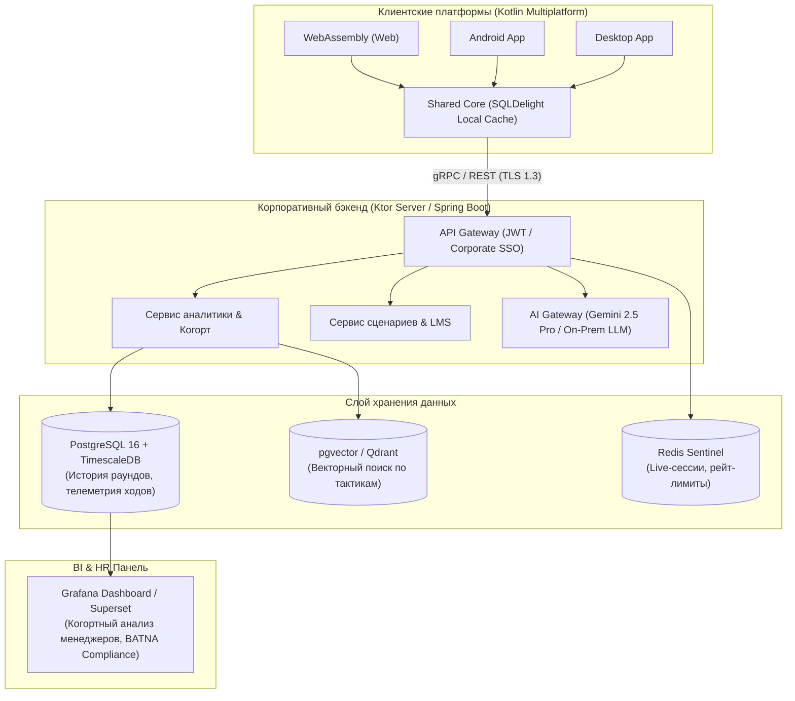

<div align="center">

# 🦾 АРЕНА B2B-ПЕРЕГОВОРОВ • ОЭЗ «АЛАБУГА»
### *Интерактивный AI-тренажер стратегических сделок с 3D-наставником Б.А.Р.С. и гарвардской методологией ZOPA*

[](https://github.com/linskay/lct2026-alabuga)
[](https://kotlinlang.org/)
[](https://www.jetbrains.com/lp/compose-multiplatform/)
[](https://kotl.in/wasm)
[-3DDC84?style=for-the-badge&logo=android&logoColor=white)](https://developer.android.com/)
[](https://www.jetbrains.com/lp/compose-multiplatform/)
[](https://github.com/linskay/lct2026-alabuga)

<br/>

> **«Учись побеждать в B2B-сделках без необоснованных уступок. Защищай BATNA, держи красные линии ОЭЗ и заключай стратегические контракты в реальном времени!»**

</div>

---

## 📌 О проекте

**Арена B2B-переговоров ОЭЗ «Алабуга»** — это высокотехнологичный тренажер для руководителей, резидентов и менеджеров по развитию бизнеса. Платформа симулирует напряженные переговоры с реалистичными AI-оппонентами различного психотипа (от жестких скептиков до прагматичных инвесторов). 

В основе системы лежит **Гарвардский метод принципиальных переговоров**, учет зон возможного соглашения (**ZOPA**), вычисление наилучшей альтернативы (**BATNA**) и непрерывный коучинг от интерактивного 3D-наставника **Б.А.Р.С.**.

---

## ⚡ Ключевые возможности и инновации

### 1. 🤖 Интерактивный 3D-наставник Б.А.Р.С.
- **Полноценная 3D-модель (GLTF/GLB)** с динамическим переключением анимаций (`wave`, `nod`, `tilt`, `talk`, `idle`) в ответ на реплики игрока и оппонента.
- **Интеллектуальный стейт-контроллер**: предотвращает бесконечные циклы анимаций, автоматически стабилизирует состояние робота в спокойный `idle`.
- **Мультиплатформенный 3D-рендеринг**: единая полигональная 3D-модель (`bars.glb`) на всех платформах — через Google `<model-viewer>` на WebAssembly и Android, и JMonkeyEngine на Desktop.

### 2. 🧠 Живой AI-оппонент с Persona Grounding & Tone Matching
- **Глубокий ролевой контекст (Gemini 2.5 Flash / OpenRouter)**: оппонент не говорит шаблонными фразами ИИ, а ведет живой, лаконичный B2B-диалог с эмоциональными реакциями, ссылками на CAPEX, OPEX, сроки ввода очередей и альтернативных контрагентов.
- **Tone Matching (Отражение тональности)**: при грубом, неформальном или панибратском вводе оппонент жестко осаждает игрока и повышает планку требований.
- **Hidden Chain-of-Thought (`internal_thought`)**: модель скрыто анализирует выгоду и риски сделки перед генерацией реплики, рассчитывая изменения шкал доверия, стресса и готовности к соглашению.
- **Smart Fallback Engine**: локальный эвристический движок мгновенно подхватывает диалог при недоступности внешних API, обеспечивая 100% бесперебойность тренировки.

### 3. ⚖️ Движок B2B-аргументации: Гарвардский метод & ZOPA
- **ИИ-Цензор ввода («Анти-Базар»)**:
  - Блокирует отправку «голых» цифр (например, *"500"*, *"+50 руб"*) и фраз короче 4 слов без аргументации.
  - Показывает всплывающую подсказку-напоминание: *«⚠️ B2B-переговоры — это не базар. Назовите уступку или обоснуйте цену»*.
- **Динамические гарвардские подсказки**:
  - Генерация аргументов по 4 ключевым паттернам: *Условие-вперед* (`"Если вы..., то мы..."`), *Защита BATNA/CAPEX*, *Пакетные уступки* и *Объективные критерии*.

### 4. 📊 Аналитический дебрифинг Neo-B2B & Экспорт в PDF
- **Аналитический дашборд**:
  - Карточка статуса исхода сделки: `СДЕЛКА ЗАКЛЮЧЕНА` (Emerald), `ПРОВАЛ ПЕРЕГОВОРОВ` (Neon Red), `КОМПРОМИСС` (Purple).
  - Линейные прогресс-бары метрик: *Доверие*, *Уровень стресса*, *Готовность к контракту*.
  - Векторные SVG-акценты без удешевляющих эмодзи, Glassmorphism-контейнеры и кибер-буллеты.
- **Умный экспорт отчета в PDF (A4 Print)**:
  - Светлая тема (`#FFFFFF` / `#F8FAFC`) для экономии краски на принтере.
  - Моментальная печать/сохранение в PDF в браузере и нативное открытие предпросмотра на Desktop.

### 5. 🛠️ Конструктор сценариев (Студия Администратора)
- Создание собственных B2B-кейсов с настройкой ZOPA (минимальная, целевая, стартовая цена), характера оппонента, лимита ходов и повестки встречи.
- Гибкая настройка API-провайдеров: Google Gemini (Direct API) и OpenRouter.

---

## 🏛️ Архитектура проекта (100% Kotlin Multiplatform)

```
lct2026-alabuga/
├── shared/                                 # Единое мультиплатформенное ядро
│   ├── commonMain/kotlin/ru/alabuga/arena/
│   │   ├── ai/                             # Интеграция с LLM (KtorGeminiService, Prompt Engineering, Fallback)
│   │   ├── model/                          # Модели предметной области (Scenario, Message, Telemetry, ZopaRange)
│   │   ├── state/                          # MVI стейт-менеджмент (ArenaState, AdminState)
│   │   ├── ui/                             # Декларативный Compose UI (HomeScreen, ArenaScreen, AdminScreen)
│   │   │   ├── components/                 # RobotView, DebriefingModal, CensorBanner, StrategyChips
│   │   │   └── theme/                      # Neo-B2B Cyber Theme (Colors, Typography, Glassmorphism)
│   │   └── util/                           # Утилиты экспорта PDF и валидации
│   ├── androidMain/                        # Android Edge-to-Edge & Immersive mode
│   ├── desktopMain/                        # Desktop JMonkeyEngine 3D & AWT Browser PDF Bridge
│   └── wasmJsMain/                         # Wasm-GC DOM Bridge & Google model-viewer host
├── app/                                    # Android Application (SDK 26–34)
├── desktop/                                # Desktop Application (Windows MSI / Executable UberJar)
├── web/                                    # WebAssembly браузерное приложение (Wasm GC)
├── .github/workflows/                      # CI/CD автоматической сборки (APK, MSI, Web)
├── Dockerfile                              # Multi-stage production Nginx + Wasm build
└── docker-compose.yml                      # Однокомандный запуск веб-версии
```

---

## 🚀 Сборка и запуск

### Требования к окружению
- **JDK**: Java 21 (Eclipse Adoptium / Azul Zulu)
- **Node.js**: 20+ (для сборки Wasm-бандла)
- **Android SDK**: Build-Tools 34.0.0+ (для сборки Android APK)

### 🌐 1. WebAssembly (Браузерная версия)
```bash
# Локальный dev-сервер с hot-reload (порт 8080)
./gradlew :web:wasmJsBrowserDevelopmentRun

# Сборка продакшн-дистрибутива (Wasm + JS)
./gradlew :web:wasmJsBrowserDistribution
```

### 📱 2. Android (APK)
```bash
# Сборка отладочного APK
./gradlew :app:assembleDebug

# Сборка релизного APK
./gradlew :app:assembleRelease
```
> Готовый файл: `app/build/outputs/apk/debug/app-debug.apk`

### 🪟 3. Desktop (Windows MSI / JAR)
```bash
# Создание нативного Windows MSI установщика
./gradlew :desktop:packageDistributionForCurrentOS

# Создание универсального исполняемого UberJar
./gradlew :desktop:packageUberJarForCurrentOS
```

### 🐳 4. Развертывание в Docker
```bash
docker compose up -d --build
```
Веб-интерфейс будет доступен по адресу: `http://localhost:3000`.

---

## 🔮 RFC: Будущая интеграция с Базой Данных и Корпоративная Аналитика

> Раздел архитектурного развития платформы для интеграции в корпоративный контур ОЭЗ «Алабуга».



### 🎯 Цели и возможности интеграции:
1. **Сквозная корпоративная телеметрия**:
   - Логирование каждого хода переговоров: время на ответ, количество исправлений текста, использование подсказок, соблюдение ZOPA.
   - Вычисление индекса жесткости переговорщика (*Negotiation Resilience Score*).
2. **Когортный анализ и LMS-синхронизация**:
   - Интеграция с корпоративными LMS через SCORM / xAPI / LTI.
   - Сравнение прогресса отделов продаж, закупщиков и резидентов ОЭЗ в динамике по месяцам.
3. **Локальный кеш на SQLDelight**:
   - Офлайн-прохождение сценариев на Android и Desktop с автоматической фоновой синхронизацией при появлении сети.
4. **Централизованный банк сценариев**:
   - Динамическая загрузка новых кейсов и обновлений правил без пересборки клиентских приложений.

---

## 👥 Команда разработчиков

**«NO PHP — NO PROBLEMS — 2026»**
- Разработано специально для **ОЭЗ «Алабуга»**.
- Стек: *100% Kotlin Multiplatform (Compose, Coroutines, Ktor, Wasm-GC, JMonkeyEngine, Material 3)*.
